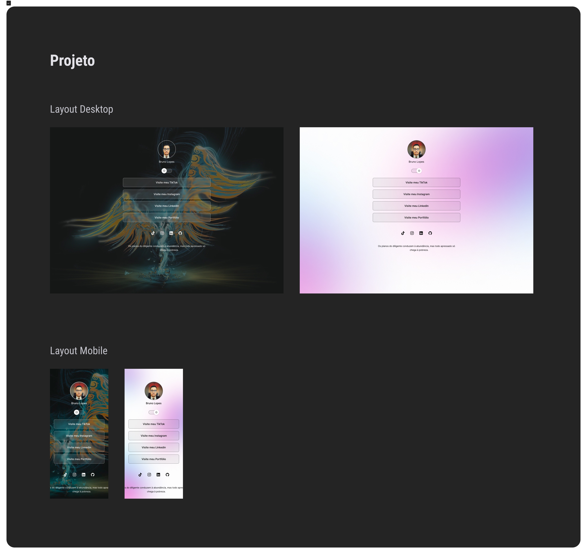

<<<<<<< HEAD
<h1 align="center"> LANDING PAGE </h1>

Projetinho web, com estudos feitos na Rocketseat.

  <a href="#-tecnologias">Tecnologias</a>&nbsp;&nbsp;&nbsp;|&nbsp;&nbsp;&nbsp;
  <a href="#-projeto">Projeto</a>&nbsp;&nbsp;&nbsp;|&nbsp;&nbsp;&nbsp;
  <a href="#-layout">Layout</a>&nbsp;&nbsp;&nbsp;|&nbsp;&nbsp;&nbsp;
  <a href="#memo-licença">Licença</a>

  

 

  

## 🚀 Tecnologias

Esse projeto foi desenvolvido com as seguintes tecnologias:

- HTML e CSS
- JavaScript
- Git e Github
- Figma

## 💻 Projeto

Uma pagina para facilitar o acesso á projetos ou redes sociais.

## 🔖 Layout

Você pode visualizar o layout do projeto através [DESSE LINK](https://www.figma.com/design/ARyNwCvsWABG1ribDyDXxu/DevLinks-%E2%80%A2-Projeto-Discover-(Community)?node-id=1439-736&t=E9dR4BWwppaUtP2l-1). É necessário ter conta no [Figma](https://figma.com) para acessá-lo.

## :memo: Licença

Esse projeto está sob a licença MIT.

---

Feito com estudos via Rocketseat :wave: [Participe da nossa comunidade!](https://discord.gg/rocketseat)
=======

>>>>>>> 38a1057c086e7e094916048003dcb4aa615a36cf
